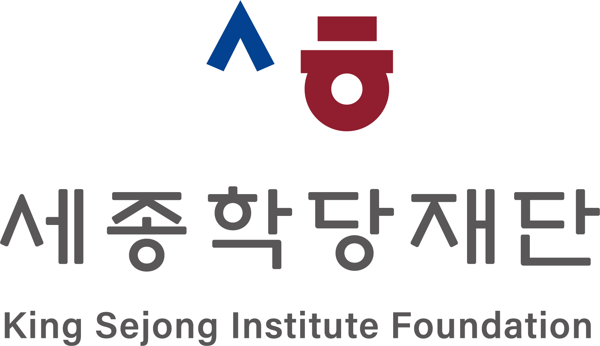

# 임수지

 ## 외국어로서의 한국어 교육에 
 깊은 관심을 가지고 있습니다. 언어학의 이해 수업을 통해 **윌리엄 라보프**의 변이 이론을 접하며, 언어 습득이 단순한 규칙 학습을 넘어 사회적 의미와 맥락 속에서 이루어지는 과정임을 이해하게 되었습니다. 이를 계기로 AI가 이러한 언어 학습을 어디까지 지원할 수 있을지에 대한 질문을 갖게 되었고, 특히 한국어 학습자에게 문법 교정을 넘어 사회적·역사적 맥락을 반영한 언어 사용까지 지도할 수 있는지에 관심을 가지게 되었습니다.

 ## 이러한 문제의식을 바탕으로 
 **국립국어원** 주최 교육(2025.10.25, 11.28)을 통해 한국어 학습자 말뭉치 분석 방법을 익혔습니다. 특히, 텍스트 데이터를 기반으로 언어 사용 패턴을 분석하는 도구인 AntConc를 활용한 실습을 통해 **베트남어** 화자의 고빈도 오류를 분석하였습니다. 이를 통해 실제 언어 데이터 기반의 AI 피드백이 문법 교정을 넘어 맥락에 적합한 표현 선택까지 확장될 수 있음을 확인하였고, 실제 언어 데이터를 기반으로 AI 기반 피드백 설계를 고민하며 연구하고 싶다는 생각을 하였습니다. 

 ## 한편 영어 학습자로서 
 대학에서 경험한 영어 수업, 영어부트캠프(2025.05)를 통해, 언어 습득에는 꾸준한 노력이 요구되며 다른 사람과 비교하지 않고 실수를 수용할 때 성장한다는 사실을 배웠습니다. 이와 같은 경험을 기반으로 한국어 학습자에게 충분히 공감하며 말뭉치 비교를 통해 담화 구조와 표현 전략의 차이를 분석하고, 이를 반영한 AI 기반 한국어 교육 모델을 연구하고자 합니다. 5년 내에는 한국어 교육 대학원 진학과 국립국어원에서 제공하는 교원 자격 취득을 바탕으로 학습자가 사회적 맥락 속에서 자신의 의견을 논리적으로 구성하고 효과적으로 전달하도록 돕는 한국어 교육 연구자로 성장하고자 합니다. 
 

